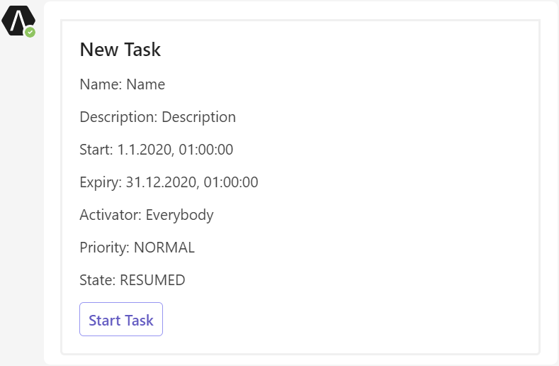
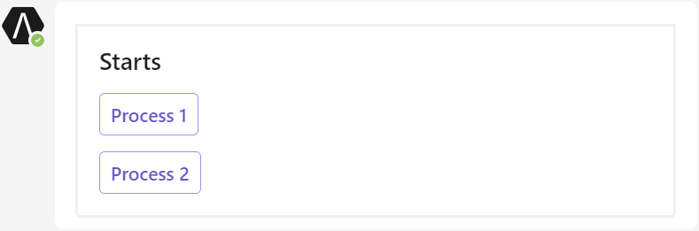

# Overview of the Ivy Teams Extension prototype

This prototype showcases a bot that sends a notification about a new Task to a Teams member triggered by a HTTP post request.
It can also respond to messages sent by the user in the form of commands.
Currently, only the command `starts` is supported, which sends a list of all process starts and the corresponding link to start the actual process back to the user.

The prototype is built using the TeamsFx SDK, which provides a simple set of functions over the Microsoft Bot Framework to implement these scenarios.

## Get Started with the Ivy Teams Extension prototype

> **Prerequisites**
>
> To run the Ivy Teams Extension prototype on your local machine, you will need:
>
> - [Node.js](https://nodejs.org/), supported versions: 16, 18
> - A [Microsoft 365 account for development](https://docs.microsoft.com/microsoftteams/platform/toolkit/accounts), your business account will suffice
> - [Teams Toolkit Visual Studio Code Extension](https://aka.ms/teams-toolkit) version 5.0.0 and higher or [TeamsFx CLI](https://aka.ms/teamsfx-cli)
>
> **Note**
>
> The prototype can be installed as a personal bot but could be extended to work in a team or a group chat.
See [Installation and Uninstallation](https://aka.ms/teamsfx-notification-new#customize-installation).

1. First, select the Teams Toolkit icon on the left in the VS Code toolbar.
2. In the Account section, sign in with your [Microsoft 365 account](https://docs.microsoft.com/microsoftteams/platform/toolkit/accounts) if you haven't already.
3. Press F5 to start debugging which launches the bot in Teams using a web browser. Select `Debug (Edge)` or `Debug (Chrome)`.
4. When Teams launches in the browser, select the Add button in the dialog to install the bot to Teams.
5. Send a POST request to `http://<endpoint>/api/notification` with your favorite tool (like `Postman`) and the following body:

   ```
   {
      "receiver": "<The email address of your Microsoft 365 account>",
      "notification": {
         "kind": "new-task",
         "name": "Name",
         "description": "Description",
         "start": "2020-01-01T00:00:00.000Z",
         "expiry": "2020-12-31T00:00:00.000Z",
         "activator": "Everybody",
         "priority": "NORMAL",
         "state": "RESUMED",
         "link": "/test/pro/test$1/StartRequestPath.ivp?taskId=2"
      }
   }
   ```

   - When your project is running locally, replace `<endpoint>` with `localhost:3978`
   - When your project is deployed to Azure App Service, replace `<endpoint>` with the url from Azure App Service

   The bot will send an Adaptive Card to Teams:

   

6. To use the command `starts`, you need to have an engine running on `http://localhost:8080` and an app with the name `test` deployed.
   The app should also contain some processes for which the starts can be returned. Then, send a message to the bot with the text `starts`.

   The bot will send an Adaptive Card to Teams:

   

## What's included in the prototype

| Folder / File        | Contents                                                                                                                 |
| -------------------- | ------------------------------------------------------------------------------------------------------------------------ |
| `teamsapp.yml`       | Main project file describes the application configuration and defines the set of actions to run in each lifecycle stages |
| `teamsapp.local.yml` | This overrides `teamsapp.yml` with actions that enable local execution and debugging                                     |
| `.vscode/`           | VSCode files for local debug                                                                                             |
| `src/`               | The source code for the bot                                                                                              |
| `appPackage/`        | Templates for the Teams application manifest                                                                             |
| `infra/`             | Templates for provisioning Azure resources                                                                               |

The following files can be customized and demonstrate an example implementation of the bot.

| Folder / File        | Contents                                                         |
| -------------------- | ---------------------------------------------------------------- |
| `src/index.ts`       | Application entry point and `restify` handlers for notifications |
| `src/teamsBot.ts`    | The teams activity handler for bot customization                 |
| `src/adaptiveCards/` | Adaptive Cards that are sent to Teams                            |
| `src/cardModels.ts`  | The Adaptive Card data models                                    |

## Extend the Ivy Teams Extension prototype

There are customizations you can make to extend the bot to fit your business requirements.

1. [Step 1: Customize the trigger point from event source](#step-1-customize-the-trigger-point-from-event-source)
2. [Step 2: Customize the notification content](#step-2-customize-the-notification-content)
3. [Step 3: Customize where notifications are sent](#step-3-customize-where-notifications-are-sent)

### Step 1: Customize the trigger point from event source

A single `restify` entry point is present in `src/index.ts`.
When a HTTP request is sent to this entry point, the implementation sends an Adaptive Card to Teams.
You can customize this behavior by customizing `src/index.ts`.
A typical implementation might make an API call to retrieve some events and/or data, and then send an Adaptive Card as appropriate.

You can also add additional triggers by:

- Creating new routing: `server.post("/api/new-trigger", ...);`
- Add Timer trigger(s) via widely-used npm packages such as [cron](https://www.npmjs.com/package/cron), [node-schedule](https://www.npmjs.com/package/node-schedule), etc. Or add other trigger(s) via other packages.

### Step 2: Customize the notification content

`src/adaptiveCards/` defines the Adaptive Cards.
You can use the [Adaptive Card Designer](https://adaptivecards.io/designer/) to help visually design your Adaptive Card UI.

`src/cardModels.ts` defines a data structures that are used to fill data for the Adaptive Card.
The binding between the model and the Adaptive Card is done by name matching (for example,`NewTask.name` maps to `${name}` in the Adaptive Card).
You can add, edit, or remove properties and their bindings to customize the Adaptive Card to your needs.

You can also add new cards if needed.
Follow this [sample](https://aka.ms/teamsfx-adaptive-card-sample-new) to see how to build different types of adaptive cards with a list or a table of dynamic contents using `ColumnSet` and `FactSet`.

### Step 3: Customize where notifications are sent

Notifications can be sent to where the bot is installed:

- [Send notifications to a channel](https://aka.ms/teamsfx-notification-new#send-notifications-to-a-channel)
- [Send notifications to a group chat](https://aka.ms/teamsfx-notification-new#send-notifications-to-a-group-chat)
- [Send notifications to a personal chat](https://aka.ms/teamsfx-notification-new#send-notifications-to-a-personal-chat)

You can also send the notifications to a specific receiver:

- [Send notifications to a specific channel](https://aka.ms/teamsfx-notification-new#send-notifications-to-a-specific-channel)
- [Send notifications to a specific person](https://aka.ms/teamsfx-notification-new#send-notifications-to-a-specific-person)

To learn more about extending the Ivy Teams Extension prototype, [visit the documentation on Github](https://aka.ms/teamsfx-notification-new).
You can find more scenarios like:

- [Customize storage](https://aka.ms/teamsfx-notification-new#customize-storage)
- [Customize adapter](https://aka.ms/teamsfx-notification-new#customize-adapter)
- [Customize the way to initialize the bot](https://aka.ms/teamsfx-notification-new#customize-initialization)
- [Add authentication for your notification API](https://aka.ms/teamsfx-notification-new#add-authentication-for-your-notification-api)
- [Connect to existing APIs](https://aka.ms/teamsfx-notification-new#connect-to-existing-api)
- [Frequently asked questions](https://aka.ms/teamsfx-notification-new#frequently-asked-questions)

## Extend Ivy Teams Extension prototype with other bot scenarios

Ivy Teams Extension prototype is compatible with other bot scenarios like command bot and workflow bot.

### Add workflow to your Ivy Teams Extension prototype

Adaptive cards can be updated on user action to allow user progress through a series of cards that require user input.
Developers can define actions and use a bot to return Adaptive Cards in response to user action.
This can be chained into sequential workflows.
Follow the [steps here](https://aka.ms/teamsfx-workflow-new#add-more-card-actions) to add workflow feature to the command bot.
Refer [the workflow document](https://aka.ms/teamsfx-workflow-new) for more information.

## Additional information and references

- [Manage multiple environments](https://docs.microsoft.com/microsoftteams/platform/toolkit/teamsfx-multi-env)
- [Collaborate with others](https://docs.microsoft.com/microsoftteams/platform/toolkit/teamsfx-collaboration)
- [Teams Toolkit Documentations](https://docs.microsoft.com/microsoftteams/platform/toolkit/teams-toolkit-fundamentals)
- [Teams Toolkit CLI](https://docs.microsoft.com/microsoftteams/platform/toolkit/teamsfx-cli)
- [TeamsFx SDK](https://docs.microsoft.com/microsoftteams/platform/toolkit/teamsfx-sdk)
- [Teams Toolkit Samples](https://github.com/OfficeDev/TeamsFx-Samples)
